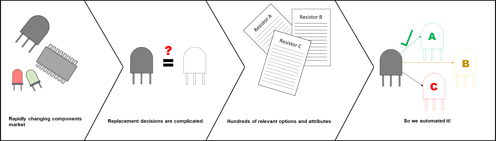
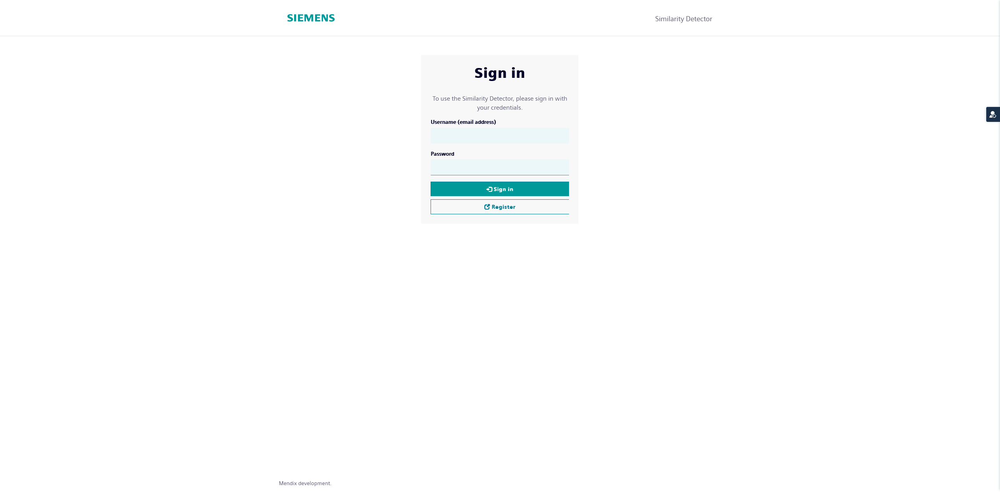
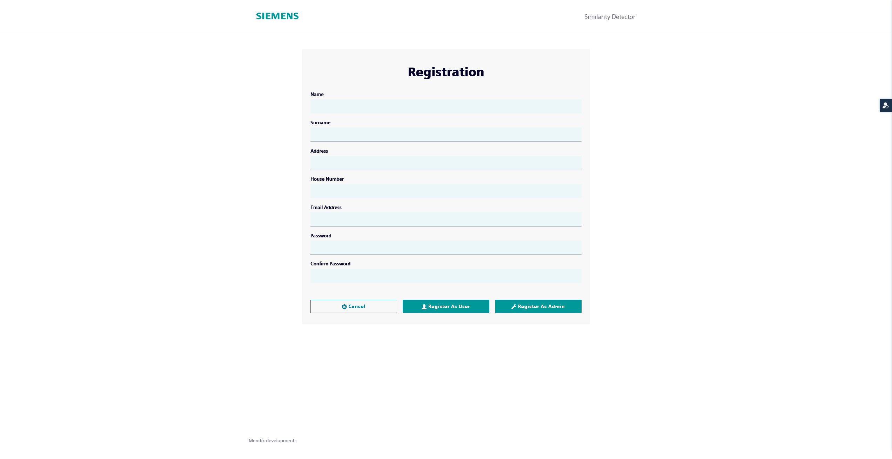
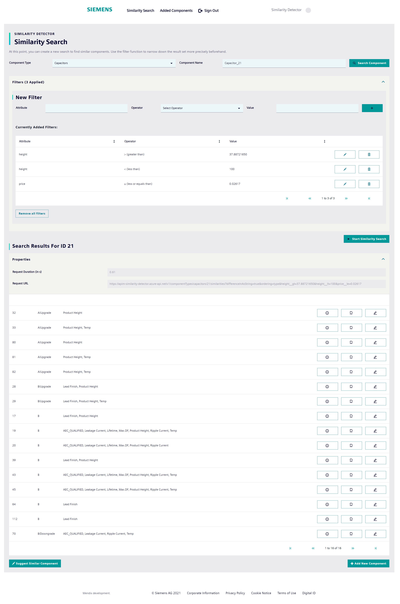
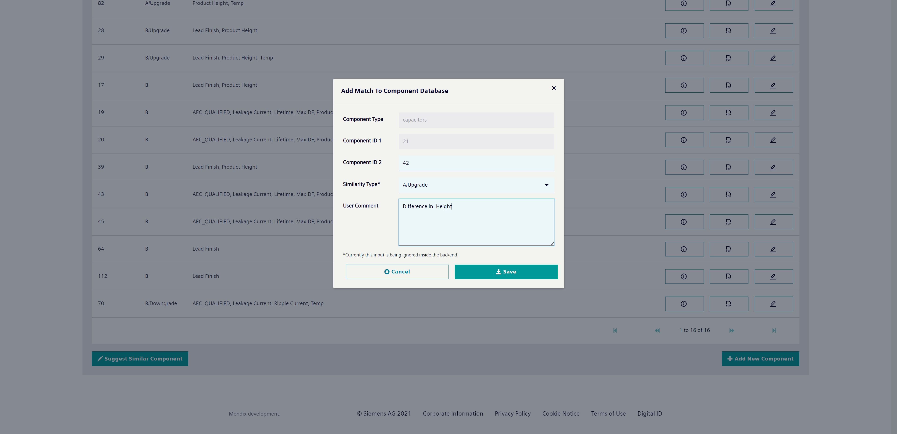
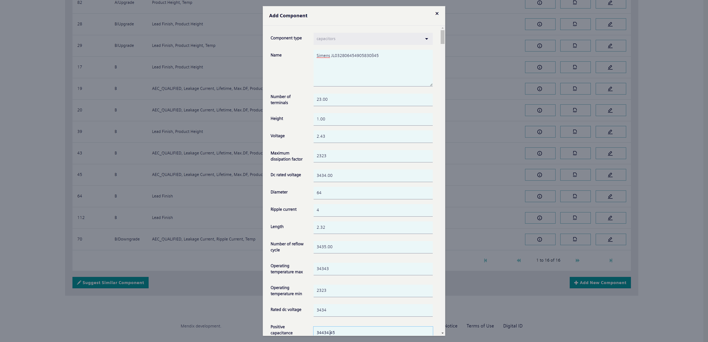
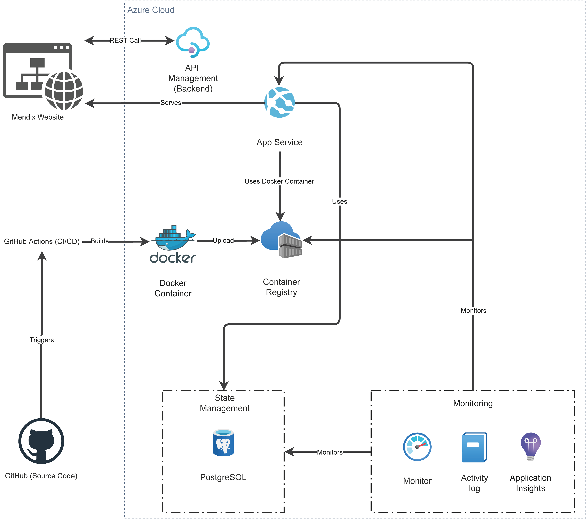
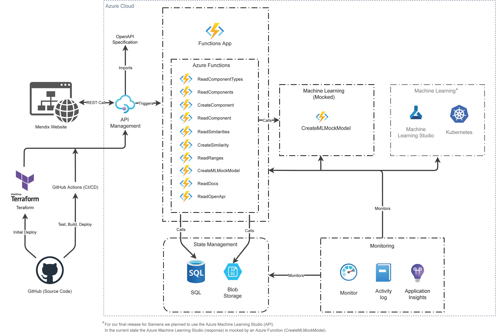

<h1 align="center">Explainable Similarity Detector</h1>
<h2 align="center">AMOS WS 2021/2022 - Project 6</h2>
<h3 align="center">amos2021ws06-exp-similarity-detector</h3>
<h4 align="center">Backend (Azure, Database, Machine Learning) / Frontend (Mendix)</h4>
<h4 align="center">Industry partner: Siemens AG</h4>

---

> Similarity detector for electronic components on basis of Explainable AI

---

## Table of contents

<!-- TOC -->

- [Table of contents](#table-of-contents)
- [Description](#description)
- [Helpful links](#helpful-links)
- [Projects](#projects)
- [Documentation](#documentation)
- [Showcase](#showcase)
  - [Demo Video](#demo-video)
  - [Login / Register](#login--register)
  - [Similarity Search](#similarity-search)
  - [Added Components](#added-components)
  - [Suggest Component / Add Capacitor](#suggest-component--add-capacitor)
- [Software Architecture](#software-architecture)
  - [Frontend](#frontend)
  - [Backend](#backend)
- [Detailed Description](#detailed-description)
  - [What was the overall Vision of our Project?](#what-was-the-overall-vision-of-our-project)
  - [Problem Statement](#problem-statement)
  - [Solution](#solution)
  - [Resources](#resources)
  - [Work Packages](#work-packages)
    - [Backend](#backend-1)
    - [Frontend](#frontend-1)
    - [Feedback Pipeline](#feedback-pipeline)
  - [How do I benefit from this?](#how-do-i-benefit-from-this)
  - [Requirements](#requirements)

<!-- /TOC -->

---

## Description 

The project goal is to develop a web service (frontend + backend) that lets users identify similar electronic components from a database using a machine learning algorithm.  

## Helpful links

- GitHub: 
  - Public repository:
    - https://github.com/amosproj/amos2021ws06-exp-similarity-detector
  - Private repository (Backend):
    - https://github.com/Re-Krass/amos2021ws06-exp-similarity-detector
  - Private repository (Frontend):
    - https://github.com/Re-Krass/amos2021ws06-exp-similarity-detector-frontend
  
## Projects
- [Similarity Detector Pipeline](https://github.com/amosproj/amos2021ws06-exp-similarity-detector/projects/1)

## Documentation

For the cooperation please follow the: [Code Of Conduct](./CODE_OF_CONDUCT.md).

- Build/Design/User Documentation:
  - [Build documentation](./Deliverables/2022-02-09_sprint-13-build-documentation.pdf)
  - [Design documentation](./Deliverables/2022-02-09_sprint-13-design-documentation.pdf)
  - [User documentation](./Deliverables/2022-02-09_sprint-13-user-documentation.pdf)
- Documentation
  - Overall Documentation (Vitepress):
    - https://amosproj.github.io/amos2021ws06-exp-similarity-detector/
    - https://stsimilaritydetector.z6.web.core.windows.net/
  - OpenAPI Documentation (Swagger UI):
    - https://apim-similarity-detector.azure-api.net/v1/docs
  - API Documentation:
    - https://amospj6.z6.web.core.windows.net/
- Deliverables
  - [Deliverables](./Deliverables/)
    - [README.md](./Deliverables/README.md)

---

## Showcase

### Demo Video

https://user-images.githubusercontent.com/38668040/154354706-a872a359-7d0e-4294-9aa7-3ad88ba600e3.mp4

- [Download](https://github.com/amosproj/amos2021ws06-exp-similarity-detector/blob/main/images/video/AMOS-Demo.mp4?raw=true)

### Login / Register

<table>
    <thead>
        <tr>
            <th align="center">Login</th>
            <th align="center">Register</th>
        </tr>
    </thead>
    <tbody>
        <tr>
            <td align="center">
                
            </td>
            <td align="center">
                
            </td>
        </tr>
        <tr>
            <td></td>
            <td></td>
        </tr>
    </tbody>
</table>

### Similarity Search

### Added Components

### Suggest Component / Add Capacitor

<table>
    <thead>
        <tr>
            <th align="center">Suggest Component</th>
            <th align="center">Add Capacitor</th>
        </tr>
    </thead>
    <tbody>
        <tr>
            <td align="center">
                
            </td>
            <td align="center">
                
            </td>
        </tr>
        <tr>
            <td></td>
            <td></td>
        </tr>
    </tbody>
</table>

---

## Software Architecture

### Frontend

### Backend

---

## Detailed Description

### What was the overall Vision of our Project?

The Explainable Similarity Detector should give all developers who work with electronic components a noticeable simplification in everyday work. Through the use of machine learning and an easily understandable surface, the time-consuming search for suitable components should be faster, more convenient and clearer. 

### Problem Statement

Siemens AG uses millions of electronic components from various providers. It is not rare that very similar components are ordered from multiple providers which leads to cost inefficiency. The similarity of components is defined through their attributes. Depending on the type of components, the number of attributes can reach several hundreds. Also, the task is complicated by the fact that there is no naming conventions nor granularity standardization that are used by the component providers for describing the components: it is possible that an attribute defined by one provider can correspond to a differently named one or even several attributes defined by a different provider. Manual processing of such data would not only be infeasible due to data volumes but would also involve an enormous mental load assuming that the expert would have to compare all the attributes.

### Solution
We want to provide a simple to use tool that allows an expert not only to detect similar or same components in the data but also reduce the mental load by providing an explanation in natural language of why certain components are similar and to what extent. Such a tool would not only ensure that similar components are found but will also create trust and transparency of the results, a feature that many modern ML tools are lacking. Providing an explanation of similarity will also reduce the mental load from the validation. The tool should be built around the existing deep learning model which we will provide. It should be able to gather feedback and trigger re-training of the model as the new annotations are supplied.

### Resources

Siemens AG will provide the current implementation of explainable AI deep learning model in PyTorch. The model was inspired by the state-of-the-art machine translation approaches of neural encoder-decoder architectures and defines the task of explainable similarity detection as a translation task from tabular data into a natural language sentence that generates a text with the degree of similarity and its explanation.

### Work Packages

#### Backend

The model should be integrated and deployed in a backend that will be communicating by a Rest API. It should make sure that it can process pairwise inputs as well as large lists of electronic components. The inference time of the model should be tested and optimized to ensure the optimal trade-off between cost and speed. The best deployment solution should be determined within the project with it potentially being deployed on the AWS with Kubernetes. The deployment should support inference and (re-)training. The backend should be cost-saving which means it should be able to scale automatically depending on the workload which means it should run on smaller instances when the workload is lower and access larger instances for heavy workloads. The backend should be able to compare the components within the list (Figure 1) as well as access a database of all the components and find the similar components among the existing once depending on the user’s preference.

#### Frontend

The frontend should be developed in framework of low-code platform Mendix. The frontend should communicate with the Backend by Rest API and be able to send and receive the data. It should visualize the output of the AI Model and allow the user to correct it. The corrected input should be sent back to the backend and stored for the further re-training of the model. The frontend should have at least following functionality:

1. Upload a list of electronic components, list length between 2 and 10000
2. Visualize the list in terms of pairwise comparison and the generated similarity
annotations
3. Create an export of the similarity pairing and automatically generated annotations
4. Accept an import of a similarity pairwise comparison and gold standard human
annotations to be further sent to the backend (e.g CSV, Excel)
5. Allow annotations and feedback communication directly from the frontend

#### Feedback Pipeline

The user feedback from the frontend should be delivered back to the backend and updating of the model should be triggered. For this the implementation should ensure the following:

1. Sanity checks and well-formedness of the annotations (e.g. handling of empty fields, spelling correction etc.)
2. The training triggering on the corresponding resources e.g. inference (WP1) will be done for the sake of cost saving on CPUs, however, retraining should be triggered on GPUs.
3. Validation of the new model. After the retraining the model should be tested to ensure that the results are not deteriorating due to the poor input data. Which means, the performance should be tested on the test set of the previous version as well as on the new data to ensure that the model does not overfit to the new data.
4. If the results are satisfactory, the new model can be put into production. However, there should be versioning of the models and the fallback to the previous model should always be possible.

### How do I benefit from this?

- No more tedious searching for documentation
- No more extensive comparisons of properties
- Opportunity to give direct feedback
- Possibility to specify similar components
- Possibility to specify completely new components

### Requirements

| Functional                        | Non-Functional                        |
| --------------------------------- | ------------------------------------- |
| Identify a component              | Implementation of frontend via Mendix |
| Search for similar components     | Backend deployed on Azure             |
| Save and export search results    | Communication via REST API            |
| Comment on search results         |                                       |
| Review user comments              |                                       |
| Transmit comments to the database |                                       |

