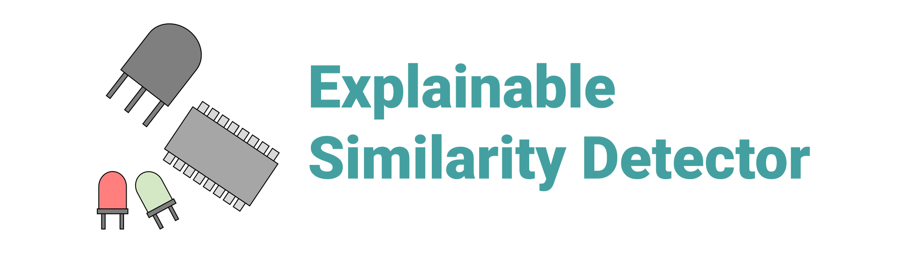

<h1 align="center">Explainable Similarity Detector</h1>
<h2 align="center">AMOS WS 2021/2022 - Project 6</h2>
<h3 align="center">amos2021ws06-exp-similarity-detector</h3>
<h4 align="center">Backend (Azure, Database, Machine Learning) / Frontend (Mendix)</h4>
<h4 align="center">Industry partner: Siemens AG</h4>

---

> Similarity detector for electronic components on basis of Explainable AI

---

# GitHub Pages Branch (Documentation)

Website: https://amosproj.github.io/amos2021ws06-exp-similarity-detector/

